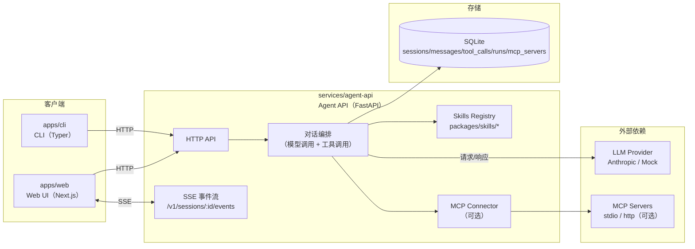

# edwinxu-agent

一个按 `DESIGN.md` 实现的 Agent 应用（Web 对话 + CLI + Agent 后端 + Skills/Tools + 可选 MCP 集成）。

## 系统架构（MVP）

### 组件
- **`apps/web`（Web UI）**：对话界面（Next.js）。通过 HTTP + SSE 连接后端，支持会话列表、新建/删除、流式输出、工具调用面板、skills allowlist、MCP 配置管理等。
- **`services/agent-api`（Agent API）**：核心服务（FastAPI）。
  - **会话/消息存储**：SQLite（默认 `data/sqlite/agent.db`，可用环境变量 `AGENT_DB_PATH` 覆盖）
  - **对话编排**：接收用户消息 → 调模型 → 执行工具（skills/MCP tools）→ 通过 SSE 推送事件
  - **流式事件**：`GET /v1/sessions/{id}/events`（SSE）
- **`apps/cli`（CLI）**：命令行入口（Typer）。调用 `agent-api` 完成同样的会话/执行流程。
- **`packages/skills`（Skills/Tools）**：内置技能包（如 `time` / `echo`），后端启动时加载并映射为可调用 tools。
- **（可选）MCP servers**：外部工具服务/进程，通过 `agent-api` 作为 MCP client 接入，并将 MCP tools 映射为 `mcp.<server>.<tool>`。

### 架构总览图



### 数据流（一次对话）
1. Web/CLI `POST /v1/sessions/{session_id}/messages`
2. 后端写入 `messages`（SQLite），并开始本轮运行
3. 后端调用模型；若模型返回 tool_use，则执行对应 tool（skills 或 MCP tools）
4. 后端通过 SSE 持续推送事件（`assistant.delta` / `tool.call` / `tool.result` / `assistant.message` 等）
5. 前端展示流式内容与工具调用详情；刷新后通过 `GET /v1/sessions/{id}/messages` 恢复历史

### 端口与地址（默认）
- Web：`http://localhost:3000`
- Agent API：`http://localhost:8080`

## 目录
- `services/agent-api/`：Agent 后端（FastAPI + SSE）
- `apps/web/`：前端对话网站（Next.js）
- `apps/cli/`：命令行客户端（Typer）
- `packages/skills/`：内置 skills（`time` / `echo`）

## 本地运行（MVP）

### 一键启动（推荐）
```bash
./scripts/bootstrap.sh
./scripts/dev-all.sh
```

### 1）后端
```bash
cd services/agent-api
# 使用 conda 的 p310 环境
conda activate p310
pip install -r requirements.txt
cp .env.example .env
uvicorn app.main:app --reload --port 8080
```

### 2）前端
```bash
cd apps/web
npm install
npm run dev
```

打开 `http://localhost:3000`。
（默认脚本会尝试用 `http://localhost:80` 启动；若端口权限不足可用 `PORT=3000 ./scripts/dev-web.sh`）

### 3）CLI
```bash
cd apps/cli
# 使用 conda 的 p310 环境
conda activate p310
pip install -r requirements.txt
# 安装命令：eag
pip install -e .
eag --help
eag run "你好" --api http://localhost:8080
```

## 模型配置（可选）
如果你设置了 `ANTHROPIC_API_KEY`（放在 `services/agent-api/.env`），后端会启用 Anthropic；否则走 mock provider（依然可用于联调与 UI 验证）。

